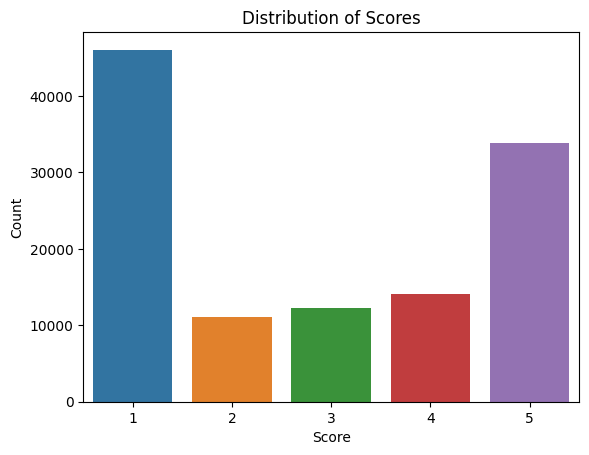
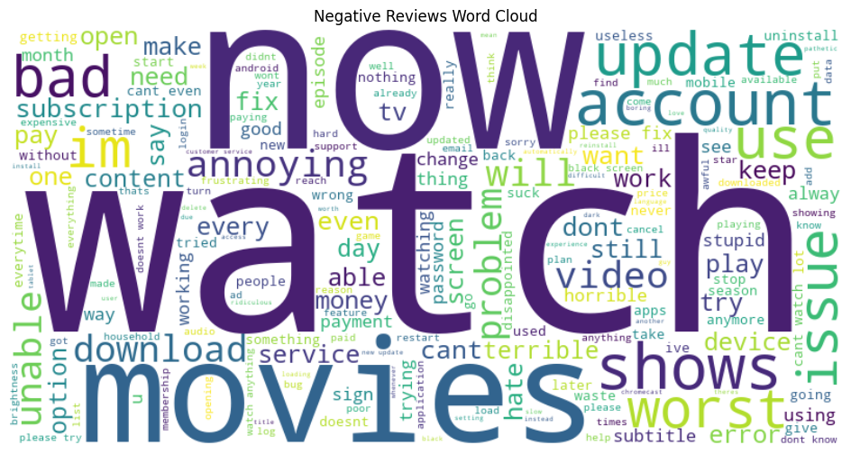

# Movie_review_rate_prediction

- Pytorch와 LSTM을 활용한 넷플릭스 리뷰 평점 예측기.
- 학습한 모델에 새로운 리뷰를 입력을 하면 그 댓글의 점수(rate)를 예측함.
- 워드클라우드와 NLP로 sementic analyze 진행.

## 코드 설명 및 주요 기능

- 활용 데이터 : [netflix_reviews.csv from Kaggle](./Movie_review_rate_prediction/netflix_reviews.csv)  

### LSTM 활용 예측 모델

[기본 코드](./Movie_review_rate_prediction/Movie%20Review%20Analyze%20copy.ipynb)  
[정확도 증가(LSTM 하이퍼파라미터 추가) 코드](./Movie_review_rate_prediction/Movie%20Review%20Analyze(정확도%20상승).ipynb)  

1. 데이터 로드 및 전처리

    - 불필요한 문장 부호나 요소들을 제거하여 데이터프레임 재구성.
    - 데이터의 분포 파악과 특성 추출을 위해 시각화 자료 활용.

      

2. 데이터셋 및 데이터로더 정의

    - pytorch에서 제공하는 함수. 배치 단위로 모델에 전달하기 쉽게 만들기 위한 기능.
    - 데이터셋 함수 정의 후, 함수 활용하여 훈련 및 테스트 데이터셋 생성.
    - collate_batch()를 통하여 데이터 가공(배치 데이터의 길이 맞춤(패딩))
    - DataLoader() 활용해 정의한 데이터셋들을 배치 단위로 모델에 전달.

3. LSTM 모델 정의

    - 배치 단위로 받은 데이터들을 임베딩 벡터로 변환하여 모델을 통해 예측값을 산출.

    하이퍼파라미터(Hyperparameter)
    - INPUT_DIM = feature 수
    - EMBEDDING_DIM = 워드벡터 차원 수(단어 추상적 표현 크기)
    - HIDDEN_DIM = 은닉층 차원 수
    - OUTPUT_DIM = 출력 값(1이면 스칼라 값. 그 이상이면 그 이상의 개수를 가짐.)
    - N_LAYERS = 재귀 층 개수. 깊이 깊을수록 복잡한 관계 학습 가능.
    - DROPOUT = 설정 확률에 따라 해당 뉴런 제거. 과적합을 방지.

4. 모델 학습 및 평가

    - 옵티마이저에는 Adam, 손실 함수는 MSE, 계산 장치는 cpu가 아닌 gpu 활용.
    - 학습 함수에는 기울기, 옵티마이저, 에포크, 역전파 등 여러 값들을 활용하여 가중치를 업데이트하며 손실을 누적하여 정확도 반환.
    - 평가 함수에는 역전파 및 기울기 계산 불필요.

5. 새 리뷰 점수 예측

    - 입력 받은 새 리뷰를 토큰화하여 고유의 정수 인덱스로 변환하여 모델에 입력 가능한 텐서형태로 넣어 예측을 수행.

### NLP, WordCloud

[NLP 및 WordCloud 코드](./Movie_review_rate_prediction/Netflix%20reviews%20with%20NLP.ipynb)  

1. 데이터 로드 및 전처리

2. df['cleaned_content']를 get_sentiment()함수 활용하여 도출한 긍정, 부정, 중립 중 하나의 감정요소를 df['sentiment_label]에 컬럼을 추가하여 각 행마다 추가.

3. 시각적으로 알아보기 쉽게 df[['cleaned_content', 'score', 'sentiment_label']]로 데이터프레임 재구성하여 출력.

4. Stopwords를 활용해 분석에서 제외할 단어들 설정 후, Wordcloud로 디자인 파라미터 설정 후, 맷플롯립 라이브러리 활용하여 시각화 자료로 출력.  
  
